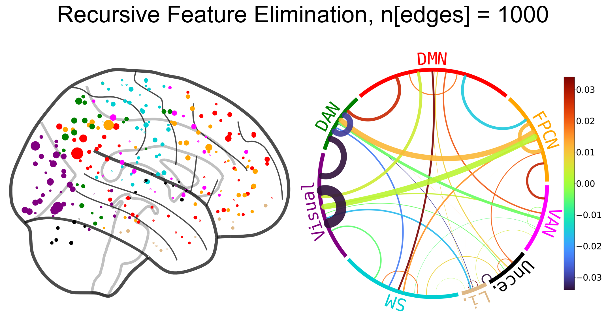

# ConnSearch

The present repo provides the Python code necessary to reproduce the primary results for the following manuscript:

Bogdan, P.C., Iordan, A. D., Shobrook, J., & Dolcos, F. (2023). ConnSearch: A 
    Framework for Functional Connectivity Analysis Designed for Interpretability
    and Effectiveness at Limited Sample Sizes. *NeuroImage*, 120274.

## Code overview

The ConnSearch analyses are done using the `ConnSearch.ConnSearcher` class. To run all the analyses used for the manuscript and to generate its visuals, a script has been provided, `scripts.run_all_ConnSearch.py`. It calls additional scripts in `scripts.group_level.py` and `scripts.subject_specific.py`. All of the code has been heavily commented, and present README provides a general overview of its organization.

## Modeling ConnSearch components

`ConnSearcher` takes connectome matrix data and binary labels as inputs. The input connectivity data (`X`) are organized as a 5D array `(subject, session, example, ROI0, ROI1)`; note that "ROI" means "Region of Interest". Each subject completed two sessions and each session yielded two examples, and these aspects are represented by the first three dimensions of the 5D array. Each example's data is a symmetric connectome matrix, which is represented by the last two dimensions. For instance, for the 50-participant dataset parcellated with the Power atlas, which has 264 ROIs, `X.shape = (50, 2, 2, 264, 264)`. The binary labels (`Y`) are organized as a 3D array, `(subject, session, example)` made up of 1s and 0s, which has the same structure as the first three dimensions of X. These data are loaded via the functions in `ConnSearch.data_loading.py`. 

Based on `X`, components are defined using the functions in `ConnSearch.components.py`. The set of components analyzed are represented as as 2D array, `(num_components, component_size)`, wherein each row represents a component as a vector of ROI indices. The components array is passed to the `ConnSearcher` object, which reorganizes `X` based on the specified indices for each component. Each component is then analyzed independently.

### Group-level analysis

For group-level ConnSearch, a classifier is trained and tested for each component. The classifier, here, is a support vector machine (SVM) but this can be easily changed. The classifier uses all the edges within a given component as features. `sklearn` is used wherever possible. Components are saved and plotted (see below) based on whether their classifier's surpass a specified accuracy threshold. 

By default, the scripts attempt to use an accuracy threshold established via permutation-testing. This threshold is generated using the `Permutation_Manager` class in `ConnSearch.permutation.Permutation_Manager.py`. Generally, permutation-testing is slow, and so you will want to run it beforehand, as its distributions will be cached. The scripts made available for running group-level ConnSearch will automatically load and use those cached permutation-testing distributions. To run the permutation-testing, use `scripts.run_permutation_testing.py`. To plot the permutation-testing distributions for different settings, use `scripts.plot_permutation_testing.py` (used to prepare Supplemental Figure S1).  

### Subject-specific analysis

Subject-specific ConnSearch involves measuring correlational similarity between examples of the same label and subtracting the correlational similarity between examples of opposite labels. These operations are done using `ConnSearch.fast_corrsim.py`, which uses `numpy` for fast matrix operations that operate on every component's data simultaneously.

## Saving and reporting ConnSearch results

The ConnSearch results are saved in `results/`, with subfolder names generated based on the parameters set for the analysis (the sample size, component size, etc.), ConnSearch will yield different results. For each set of parameters, the ConnSearch outputs are saved in a unique directory. The directory name is generated automatically using `ConnSearch.names.get_save_name`. For example, the directory name may be `results/ConnSearch_Group/power_comp16_nspl5_nrep10_N50`, indicating that the analysis was group-level ConnSearch using the N = 50 Power atlas dataset, that the component size was 16, and that cross-validation used 5 folds then averaged across 10 repetitions. 

The ConnSearch results can be plotted in two ways: First, each component can be plotted individually, using the [`NiChord`](https://github.com/paulcbogdan/NiChord) package, which we developed for this research. This is shown in the top part of the figure right below. Second, every component's score, such as its classifier accuracy or its t-value, is plotted by coloring ROIs on a glass brain. ROIs are colored based on the average score assigned to the components in which the ROI was included. This is shown in the bottom part of the figure right below.

  

In addition to using `NiChord`, several functions in `ConnSearch.reporting.plotting_ConnSearch.py` and `ConnSearch.reporting.plotting_general.py` help with plotting. The former module is used solely for the ConnSearch plotting. The latter module is also used for plotting the methods to which ConnSearch was compared in the manuscript (see below).

Along with these visuals, the ConnSearch components are also reported as tables, using the functions in `ConnSearch.reporting.ConnSearch_tables.py`. These functions automatically assign network, regions, and Brodmann Area labels for each ROI based on its assigned MNI coordinate; see tables 1 and 3 in the manuscript.

## Methods implemented for comparisons

The neural patterns implicated by ConnSearch were compared those found by six other methods. Their code is `comparison_methods/`. These other methods include four techniques where users fit a connectomewide classifier and then interpret the classifier using various post hoc techniques. These consistent of recursive feature elimination (`RFE.py`), neighborhood component feature selection (`NCFS.py` & `NCFS_feature_cutoff.py`), connectome predictive modeling (`NBS.py`), kernel ridge regression with Haufe transformation (`Haufe.py`). Two frequentist methods were also implemented: network-based statistic (`NBS.py`) and paired t-tests (`ttest.py`). All of these implementations follow a similar structure. The focus is only on the plots and tables generated via interpretation analysis and not the accuracy of classifiers.

The comparison methods can all be run using `scripts.run_comparison_methods.py`

  

## Preprocessed data

Preprocessed data needed for the primary 50-participant analyses of the Power atlas are provided in the repo. The  dataset (`in_data/Power/power_n50_d0.pkl`, 106 MB) squeezes just under the 100 MB limit for GitHub if it is zipped (`in_data/Power/power_n50_d0.zip`, 98 MB). Running the scripts will automatically unzip it for you. Along with just this data, our permutation-testing results are also provided along with various other cache files to help things run quickly (e.g., dictionaries mapping ROI coordinates to brain regions).

## Additional techniques

The code also provides some features not emphasized in the manuscript but used for preliminary analyses. Two are notable.

First, the scripts allow defining components based on proximity to a Core ROI (i.e., components are groups of ROIs close together), which is useful for analyses where effects are localized but MVPA searchlights do not span enough volume. This can be done by simply setting `proximal=True` in `group_level.py` or `subject_specific.py`.

Second, the present code can be used to implement the analyses by Wu, Eickhoff, Hoffstaedter et al. (2021; Cerebral Cortex) in the context of task classification. Wu et al. (2021) describe a method where, for each ROI, a classifier is fit using all connections to that ROI as features - e.g., for a 264-ROI atlas, it fit 264 classifiers each with 263 features. The `ConnSearcher` class is capable of doing this analysis, and the functions provided in the scripts `group_level.py` and `subject_specific.py` can be used to run the analysis, by simply changing `wu_analysis=True` and `comp_size=None` (see also docstrings). Just below, we illustrate one significant result using the Wu et al. (2021) method, applied to the present dataset and 2-back vs. 0-back classification problem.

  

## Notes

Plotting is based on the [`NiChord`](https://github.com/paulcbogdan/NiChord) package. However, the plots used for the manuscript use a modified version of [`NiChord`](https://github.com/paulcbogdan/NiChord) to generate the colorbar titles, adjust colorbar fontsizes, and adjust colors/arcs to better show differences. These visual aspects were hardcoded and said version of `NiChord` has not been pushed, meaning that your plots may look slightly different than those in the manuscript.

We found that `sklearn.model_selection.StratifiedGroupKFold` has an issue in that it often doesn't find the most ideal stratification for each fold. This is particularly important for research likes ours where an emphasis is placed on whether accuracy beats chance. The present code fixes this in the new class `ConnSearch.crossval.ConnSearch_StratifiedGroupKFold`. In addition, the code provides `ConnSearch.crossval.RepeatedStratifiedGroupKFold`, which repeats the stratified group-k-fold and averages test accuracy across the repetitions.

The manuscript reports behavioral data on how well participants completed the N-back task. `scripts/run_WM_behavioral.py` generates these data. The script compares participant's accuracy across the five 50-participant groups used for the paper.

Please feel free to use our Python implementations and plotting tools developed for the comparison methods.